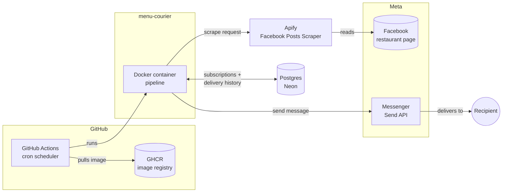

# menu-courier


A small, scheduled service that scrapes a local restaurant's daily menu post from Facebook and delivers it via Messenger — built mainly for Ms. Helena, an elderly family friend who has trouble with her vision and can't check Facebook herself to check what's for lunch.

It also doubles as a portfolio piece: the goal was to build it the way I would build anything meant for production at work — typed config, migrations, tests, CI, a
container image, and a scheduled pipeline — rather than a one-off script.

## How it works



Subscriptions (which page to watch, who receives it, optional text filter, whether
to include images) are just rows in a table — adding a new restaurant/recipient
pair is one CLI command, not a code change. On each run, the pipeline loops over
every active subscription: it scrapes the latest matching post, skips it if that
exact post has already been delivered, and otherwise sends the text and any
images via Messenger and records the outcome (sent or failed) back in Postgres.

## Why these particular building blocks

- **Scraping via [Apify](https://apify.com)'s Facebook Posts Scraper**, not a
  homegrown scraper. Facebook has no practical public API for this, and every
  free/open-source Facebook scraper we evaluated was effectively abandoned —
  scraping a platform that actively fights scrapers is a maintenance burden best
  left to a service built for it. Apify's free tier comfortably covers this
  project's volume (a few checks a day on one page).
- **Messenger Send API**, hand-rolled on top of `requests` rather than a wrapper
  library — the wrapper libraries that exist for this are unmaintained since
  ~2016, and the API itself is a couple of authenticated HTTP calls, not enough
  surface to justify a dependency.
- **Neon (serverless Postgres)** for storage — scales to zero between runs, free
  tier is generous for this project's tiny footprint, and it's a real database
  rather than a scraped-together file.

## CLI

All commands run as `poetry run menu-courier <command>`.

| Command | What it does |
|---|---|
| `run` | Run the pipeline once — check every active subscription and deliver anything new |
| `list-subscriptions` | List all subscriptions and whether they're active |
| `list-recipients` | Look up a PSID from recent Messenger conversations |
| `add-subscription` | Add a new subscription (see flags below) |
| `deactivate-subscription --id N` | Deactivate a subscription without deleting its history |

`add-subscription` takes a few flags:

```bash
poetry run menu-courier add-subscription \
    --platform facebook \
    --source-handle "https://www.facebook.com/..." \
    --recipient-psid ... \
    --recipient-label "..." \
    --text-filter "..." \
    [--no-images]
```

## Local development

Requirements: Python 3.12+, [Poetry](https://python-poetry.org), Docker.

```bash
poetry install
docker compose up -d          # local Postgres for development
cp .env.example .env          # fill in real values, see below
poetry run alembic upgrade head
poetry run pytest
```

### Environment variables

See `.env.example`. In short:

| Variable | What it's for |
|---|---|
| `DATABASE_URL` | Postgres connection string (`postgresql+psycopg://...`) |
| `FB_PAGE_ACCESS_TOKEN` | Page Access Token for the Messenger bot's Facebook Page |
| `APIFY_API_TOKEN` | Apify API token (Facebook Posts Scraper) |

`DATABASE_URL` always points at whatever database you want a given command to hit.
For day-to-day work that's the local Postgres from `docker compose`. Never point
`.env` itself at production — use a one-off override instead:

```bash
DATABASE_URL="..." poetry run menu-courier list-subscriptions
```

Admin commands (`add-subscription`, `deactivate-subscription`) print which
database host they're about to touch and ask for confirmation before writing
anything.

## One-time manual setup (outside the code)

Facebook doesn't let this kind of thing be fully automated from scratch. Once per
project (not per recipient):

1. Create a dedicated Facebook Page for the bot (not the restaurant's page).
2. Create a Facebook App (Development mode — no App Review needed for this use
   case), add the Messenger product, connect it to the Page, generate a Page
   Access Token.

Once per recipient:

1. They register as a Facebook Developer (developers.facebook.com) — required by
   Meta before anyone can be assigned a role on an app.
2. Add them as a Tester on the app (App roles → Roles).
3. They accept the invitation and send any message to the bot's Page once.
4. `poetry run menu-courier list-recipients` to read off their PSID.
5. `add-subscription` with that PSID.

## Testing & code quality

```bash
poetry run pytest
poetry run pre-commit run --all-files
```

Pre-commit runs ruff (lint + format), mypy, and detect-secrets. Tests are unit
tests only — HTTP calls (Apify, Messenger) are mocked via `responses`, and the
pipeline tests mock the storage layer. There's no database in CI; the real
scraping/delivery path is verified manually against the live services.

## Deployment

- `Dockerfile` builds a multi-stage image (Poetry installs deps in a builder
  stage, only the resulting `.venv` + source ship in the final image).
- CI (`.github/workflows/ci.yml`) lints and tests on every push/PR. The image is
  only built and pushed to GHCR when a `v*` tag is pushed — releases are
  deliberate, not automatic on every merge:
  ```bash
  gh release create v0.4.0 --generate-notes
  ```
- `.github/workflows/scheduled-send.yml` runs the pipeline on a cron schedule,
  pulling the `:latest` image from GHCR and pointing it at the production
  (Neon) database via GitHub Secrets.

## Known limitations

- Scraping a restaurant's public page without their cooperation is, strictly,
  outside Facebook's ToS — accepted here given the low frequency (a few checks a
  day) and assistive purpose. Apify's infrastructure absorbs the actual
  anti-scraping risk rather than this project's own IP.
- The Facebook App stays in Development mode: it can only message people who
  have accepted a Tester/Developer/Admin role on the app. Messaging the general
  public would require Meta's App Review, which is disproportionate for a
  single-recipient personal tool.
